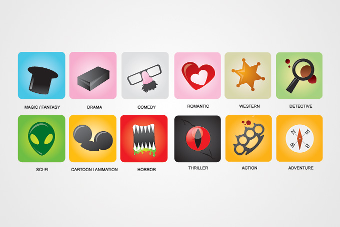

# Классификация фильмов по жанрам

### Описание
 
Проект посвящен определению жанров фильмов по текстовому описанию.
Для классификации используется модель на базе рекуррентной нейронной сети.
  
### Результаты
 
Было построено 3 варианта классификаторов:

  * **Вариант 1** - обучение модели только для жанров, у которых более 7 000 примеров в выборке. Результат: точность **78%**
  * **Вариант 2** - обучение модели на объединенных жанрах (у которых объединены близкие по смыслу жанры). Результат: точность **60%**
  * **Вариант 3** - применен другой принцип организации исходных данных (самые часто встречающиеся слова кодируются одним индексом и т.п.), в качестве loss используется 'sparse_categorical_crossentropy'. Результат: точность **53%**

**Вывод**: для лучших результатов обучения нужно больше данных, а именно количество примеров для каждого жанра должно быть больше 7 000, а лучше больше 10 000.
  
### Структура проекта
 
    
    data                           исходные данные
    MovieClassificator_v1.ipynb    Вариант 1
    MovieClassificator_v2.ipynb    Вариант 2
    MovieClassificator_v3.ipynb    Вариант 3
